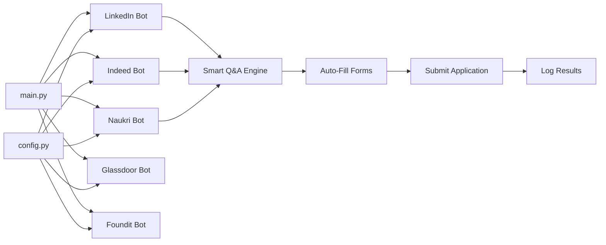

<p align="center">
  
</p>

<h1 align="center">🤖 Multi-Platform Job Apply Bot</h1>

<p align="center">
  <strong>Automate job applications across LinkedIn, Indeed, Naukri, Glassdoor & Foundit</strong>
</p>

<p align="center">
  <a href="#platforms">Platforms</a> •
  <a href="#features">Features</a> •
  <a href="#quick-start">Quick Start</a> •
  <a href="#configuration">Configuration</a> •
  <a href="#architecture">Architecture</a> •
  <a href="#sponsors--support">Sponsor</a> •
  <a href="#contributing">Contributing</a>
</p>

<p align="center">
  
  
  
  
  <a href="https://github.com/sponsors/RayeesYousufGenAi"></a>
</p>

---

## 🎯 What Is This?

A **Selenium-based automation bot** that applies to jobs on **5 major platforms** — all from one CLI. It fills forms, uploads your resume, answers screening questions using a **smart Q&A engine**, and handles multi-step application flows automatically.

> **Built for job seekers** who want to spend time preparing for interviews, not clicking "Apply" buttons 100 times a day.

---

## <a id="platforms"></a>🌐 Supported Platforms

| Platform | Status | Easy Apply | Notes |
|----------|--------|------------|-------|
| **LinkedIn** | ✅ Full | ✅ | Easy Apply modal handler with pagination |
| **Indeed** | ✅ Full | ✅ | SmartApply handler (new tab + iframe detection) |
| **Naukri** | ✅ Full | ✅ | India's #1 job portal |
| **Glassdoor** | ✅ Full | ✅ | With company insights |
| **Foundit** (Monster India) | ✅ Full | ✅ | Ex-Monster rebranded |

---

## <a id="features"></a>✨ Features

### 🧠 Smart Answer Engine
- **Keyword-based Q&A matching** — maps question text to pre-configured answers
- **Intelligent fallbacks** — handles unknown questions with smart defaults
- **188+ response patterns** supported out of the box

### 🤖 Automation Capabilities
- **Auto-fill** all form fields — text, dropdowns, radio buttons, checkboxes
- **Resume auto-upload** on platforms that accept it
- **Multi-page form navigation** — clicks Continue/Next/Submit across steps
- **Human-like typing** with randomized delays to avoid detection
- **Bot detection bypass** — anti-automation flags disabled

### 🏗️ Architecture
- **Run individually** — pick any single platform
- **Run ALL concurrently** — 5 platforms in parallel using `ThreadPoolExecutor`
- **Persistent Chrome profile** — remembers logins across sessions
- **Detailed logging** — per-session `.log` files + applied jobs tracker

---

## <a id="quick-start"></a>🚀 Quick Start

### Prerequisites
- Python 3.8+
- Google Chrome browser installed

### 1. Clone & Install

```bash
git clone https://github.com/RayeesYousufGenAi/multi-platform-job-apply-bot.git
cd multi-platform-job-apply-bot

pip install -r requirements.txt
```

### 2. Configure

```bash
cp config.example.py config.py
```

Edit `config.py` with your details:

```python
PERSONAL = {
    "first_name":   "Your Name",
    "email":        "you@email.com",
    "phone":        "1234567890",
    "resume_path":  "Your_Resume.pdf",
    # ... fill all fields
}

LINKEDIN = {
    "email":    "you@email.com",
    "password": "your-password",
}
```

### 3. Add Your Resume
Place your resume PDF in the project root directory.

### 4. Run

```bash
python main.py
```

You'll see:
```
==============================================================
      MULTI-PLATFORM JOB APPLY BOT
==============================================================
1. LinkedIn Bot
2. Indeed Bot
3. Naukri Bot
4. Glassdoor Bot
5. Foundit (Monster) Bot
6. Run ALL Concurrently (Warning: Heavy System Load)
==============================================================
Enter your choice (1-6):
```

---

## <a id="configuration"></a>⚙️ Configuration

### `config.py` Sections

| Section | Purpose |
|---------|---------|
| `PERSONAL` | Your name, email, phone, resume path, demographics |
| `LINKEDIN` / `INDEED` / etc. | Platform-specific login credentials |
| `SEARCH` | Keywords, location, filters, max applications per session |
| `WORK_AUTH` | Work authorization, visa, relocation preferences |
| `EDUCATION` | Degree, university, graduation year |
| `EXPERIENCE` | Years of experience, current role, salary expectations |
| `SAVED_ANSWERS` | 100+ keyword→answer mappings for screening questions |

### Search Configuration

```python
SEARCH = {
    "keywords": ["Project Coordinator", "AI Automation Specialist"],
    "location": "India",
    "remote_only": True,
    "easy_apply_only": True,
    "max_applications": 30,        # per session
    "experience_level": ["Entry Level", "Mid-Senior Level"],
    "date_posted": "past week",
}
```

---

## <a id="architecture"></a>🏗️ Project Architecture

```
multi-platform-job-apply-bot/
├── main.py                 # CLI orchestrator — platform selection & concurrent runner
├── config.example.py       # Template config (copy → config.py)
├── config.py               # Your personal config (⚠️ gitignored)
│
├── linkedin_bot.py         # LinkedIn Easy Apply automation
├── indeed_bot.py           # Indeed SmartApply automation
├── naukri_bot.py           # Naukri Quick Apply automation
├── glassdoor_bot.py        # Glassdoor Easy Apply automation
├── foundit_bot.py          # Foundit (Monster) Apply automation
│
├── assets/
│   └── logo.png            # Project logo
│
├── requirements.txt        # Python dependencies
├── .gitignore              # Ignores config.py, logs, chrome_profile
├── LICENSE                 # MIT License
└── README.md               # This file
```

### Data Flow



---

## 📊 Output

After each session, the bot creates:

| File | Purpose |
|------|---------|
| `applications_YYYYMMDD_HHMM.log` | Detailed real-time log of all actions |
| `applied_jobs_YYYYMMDD.txt` | Clean list of successfully applied jobs |

---

## ⚠️ Important Notes

1. **Platform daily limits** — LinkedIn caps at ~80-100 Easy Apply/day. Bot defaults to 30/session.
2. **CAPTCHA handling** — If a CAPTCHA appears, solve it manually; the bot will wait.
3. **Manual login required** — For security, log into each platform manually the first time. The persistent Chrome profile remembers sessions.
4. **Use responsibly** — This tool is for personal job searching. Respect each platform's Terms of Service.

---

## 💖 Sponsors & Support

Building and maintaining this multi-platform job application automation bot requires significant time, reverse-engineering, and effort. If this bot has helped you automate your job search and land interviews, please consider supporting the development!

<p align="center">
  <a href="https://github.com/sponsors/RayeesYousufGenAi">
    
  </a>
  <a href="https://paypal.me/rayeesyousuf">
    
  </a>
</p>

---

## 🤝 <a id="contributing"></a>Contributing

Contributions are welcome! Here are some ways to help:

- 🐛 **Report bugs** — Open an issue with steps to reproduce
- 💡 **Feature requests** — Suggest new platforms or improvements
- 🔧 **Pull requests** — Fix bugs or add features

### Development Setup

```bash
git clone https://github.com/RayeesYousufGenAi/multi-platform-job-apply-bot.git
cd multi-platform-job-apply-bot
pip install -r requirements.txt
cp config.example.py config.py
# Edit config.py with your test credentials
```

---

## 📜 License

This project is licensed under the MIT License — see the [LICENSE](LICENSE) file for details.

---

## 👤 Author

**Rayees Yousuf**  
AI Automation & Agent Builder

[](https://www.linkedin.com/in/rayeesyousuf/)
[](https://github.com/RayeesYousufGenAi)

---

<p align="center">
  <strong>⭐ Star this repo if it helped you land interviews!</strong>
</p>
